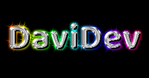

## Benvenuto sul mio GitHub

Sono un ragazzo di 28 anni con tanta passione e volontà di migliorare le mie conoscenze nel mondo della programmazione.

La cosa che più mi stimola è sicuramente la necessità di essere sempre al passo, non esiste giorno in cui non abbiamo la possibilità di metterci alla prova apprendendo nuove skills o approfondire quelle già in possesso.

Ho iniziato a studiare in completa autonomia linguaggi come Html e Css, fino ad arrivare alla necessità di introdurre nei miei studi veri e propri linguaggi di programmazione come Js. 
Su questi linguaggi ho studiato le basi della programmazione, toccando anche qualche nozione riguadante l'hardware, cosa che da piccolo mi ha sempre incuriosito.

Ho proseguito i miei studi attraverso community e libri di testo, portandomi ad approfondire la parte back-end attravrso lo studio di Python ed introducendo framework come Django.

Ho voglia di ampliare le mie conoscenze e mettermi in gioco toccando con mano i veri aspetti di questo lavoro all'interno di un vero team lavorativo. 

Penso che non ci sia cosa più bella di poter fare della propria passione un lavoro, anche se lo studio e la continua voglia di rimanere al passo ed aggiornato sarà sempre parte di me. :blush:

>“Fai quello che ami e non lavorerai un solo giorno della tua vita”

