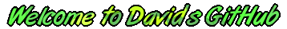

    Ciao a tutti, mi chiamo David e sono un ragazzo di 28 anni :wave:

    :cyclone: Ho frequentato studi in ambito economico, anche se ho avuto la fortuna di poter studiare informatica basilare per 3 anni. 

    zap: Finiti gli studi ho fatto diversi lavori, principalmente in ambito amministrativo, anche se la passione e la buona volontà di migliorare le mie conoscenze nel mondo della programmazione non si sono fermate. 

    :muscle: Da autodidatta ho approfondito gli studi in Html e Css, fino ad arrivare ai primi linguaggi di programmazione come Js, che mi ha permesso di studiare le basi della programmazione, e Python che ho approfondito particolarmente fino ad arrivare al mio primo framework come Django. 

    :boom: La cosa che più mi stimola è sicuramente la necessità di essere sempre al passo, non esiste giorno in cui non abbiamo la possibilità di metterci alla prova apprendendo nuove skills o approfondire quelle già in possesso.

    :fire: Ho voglia di ampliare le mie conoscenze e mettermi in gioco toccando con mano i veri aspetti di questo lavoro all'interno di un vero team lavorativo. 
    Penso che non ci sia cosa più bella di poter fare della propria passione un lavoro, anche se lo studio e la continua voglia di rimanere al passo ed aggiornato sarà sempre parte di me. :blush:

    “Fai quello che ami e non lavorerai un solo giorno della tua vita”

    

